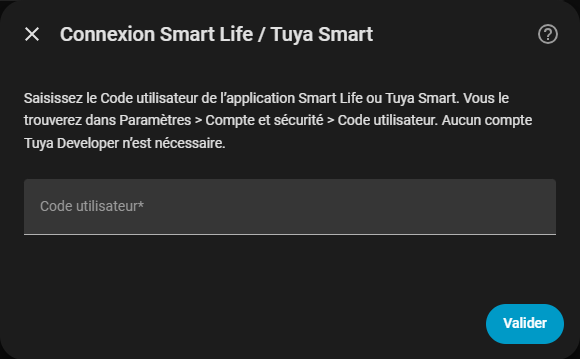
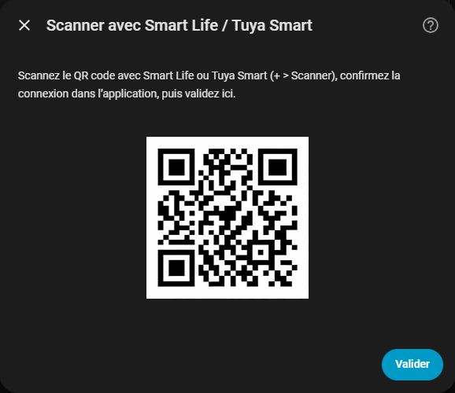
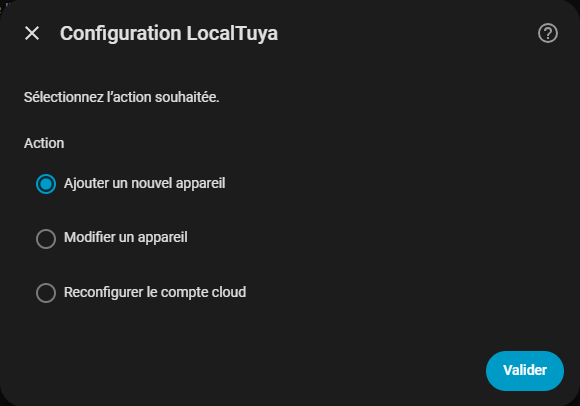
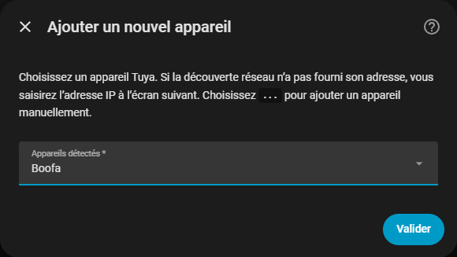
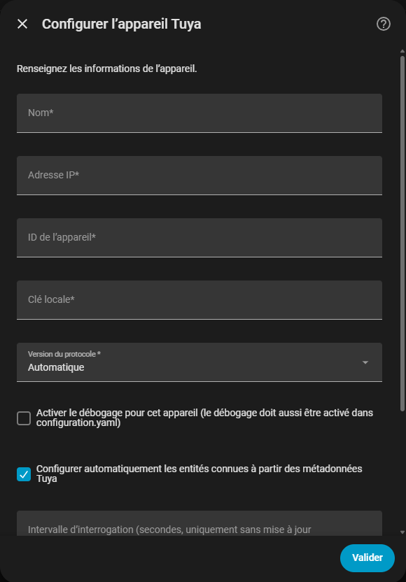

  

**LocalTuya Connect** est une intégration personnalisée pour Home Assistant permettant de contrôler localement les appareils Tuya. Elle propose une installation simplifiée basée sur le **Code utilisateur + connexion par QR code** de Smart Life / Tuya Smart, ainsi qu'une configuration automatique des entités à partir des capacités déclarées par les appareils.

## Fonctionnalités principales

- Aucun projet **Tuya Developer** n'est nécessaire pour la méthode d'installation recommandée.
- Connexion avec le **Code utilisateur** Smart Life / Tuya Smart et validation par QR code.
- Récupération automatique de la liste des appareils et de leurs clés locales.
- Détection automatique des protocoles LAN Tuya 3.1 à 3.5.
- Découverte LAN Tuya 3.5 avec sollicitation UDP 7000 et réponses au format 6699.
- Détection des DPS disponibles sur l'appareil.
- Configuration automatique des entités à partir des codes sémantiques Tuya fournis par `local_strategy`, `function` et `status_range`.
- Aucune dépendance à une marque, un modèle ou une liste de numéros de DP codés en dur.
- Interface de configuration entièrement traduite en français.
- Traductions complètes en français, anglais, allemand, espagnol, italien, néerlandais et portugais du Brésil.
- Configuration manuelle des DPS et des entités toujours disponible en complément.
- Diagnostics protégés : les clés locales, jetons de connexion, identifiants d'appareils et adresses IP sont masqués.

## Installation

### Avec HACS

1. Ajoutez ce dépôt dans HACS en tant que **dépôt personnalisé de type Intégration**.
1. Installez **LocalTuya Connect**.
1. Redémarrez Home Assistant.

### Installation manuelle

Copiez le dossier `custom_components/localtuya` dans le répertoire `/config/custom_components/` de Home Assistant, puis redémarrez Home Assistant.

## Configuration pas à pas

### 1. Récupérer le Code utilisateur

Dans l'application **Smart Life** ou **Tuya Smart**, ouvrez **Paramètres → Compte et sécurité → Code utilisateur** et relevez le Code utilisateur affiché.

### 2. Ajouter LocalTuya Connect et saisir le Code utilisateur

Dans Home Assistant, ouvrez **Paramètres → Appareils et services**, puis sélectionnez **+ Ajouter une intégration → LocalTuya Connect**.

Saisissez ensuite le **Code utilisateur** récupéré à l'étape précédente.

### 3. Scanner le QR code

Scannez le QR code affiché par Home Assistant avec l'application **Smart Life** ou **Tuya Smart**, puis confirmez la connexion dans l'application.

> **Sécurité :** le QR code présenté dans cette documentation est factice et ne contient aucun jeton de connexion réel.

### 4. Ouvrir les options de LocalTuya Connect

Une fois la connexion terminée, ouvrez les options en cliquant sur **l'engrenage de LocalTuya Connect** pour ajouter un appareil.

### 5. Sélectionner l'appareil

Sélectionnez l'appareil Tuya que vous souhaitez ajouter à Home Assistant.

### 6. Configurer l'appareil

Renseignez son adresse IP locale si la découverte réseau ne l'a pas trouvée.

Laissez **Version du protocole** sur **Automatique** et laissez activée la configuration automatique des entités connues à partir des métadonnées Tuya.

LocalTuya Connect détecte alors automatiquement le protocole compatible, les DPS disponibles et les entités qu'il peut configurer.

## Principe de l'auto-configuration

LocalTuya Connect analyse les codes sémantiques et les métadonnées fournis par Tuya. Le système ne dépend pas d'une marque, d'un identifiant produit ou d'une disposition fixe des DPS.

### Validé sur du matériel réel

- Prises connectées : interrupteur, tension, courant, puissance et énergie cumulée fournie par le micrologiciel.
- Ampoules RGB+CCT : marche/arrêt, luminosité, température de couleur, couleur et modes.
- Énumérations modifiables → entités `select`.
- Entiers modifiables avec `scale=0` → entités `number`.

### Implémenté mais pas encore validé sur du matériel réel

- Booléens en lecture seule → entités `binary_sensor`.

### Expérimental et désactivé par défaut

- Volets et rideaux (`cover`).
- Ventilateurs (`fan`).
- Chauffage, thermostats et climatisation (`climate`).
- Aspirateurs robots (`vacuum`).

Consultez [SUPPORT_MATRIX.md](SUPPORT_MATRIX.md) pour connaître précisément le niveau de prise en charge.

## Remarque concernant l'énergie

Le DPS `add_ele` correspond à une valeur d'énergie cumulée fournie directement par le micrologiciel Tuya. Selon les appareils, cette valeur peut être mise à jour normalement, rarement ou parfois pas du tout.

LocalTuya Connect expose cette information lorsqu'elle existe dans les métadonnées, mais l'entité reste désactivée par défaut. Cette version ne calcule pas artificiellement une consommation d'énergie à partir de la puissance instantanée.

## Signaler un appareil à la communauté

Pour un appareil non pris en charge ou seulement partiellement reconnu :

1. Ajoutez l'appareil normalement dans LocalTuya Connect.
1. Téléchargez les diagnostics Home Assistant associés à l'appareil.
1. Vérifiez le fichier avant toute publication.
1. Ouvrez une issue sur le dépôt et joignez les diagnostics.

Les diagnostics masquent notamment les `local_key`, jetons de connexion, identifiants de compte ou d'appareil et adresses réseau. Les informations techniques nécessaires à l'amélioration de l'auto-configuration sont conservées : catégorie Tuya, codes sémantiques, numéros de DPS, types, unités et plages de valeurs.

**Ne publiez jamais une `local_key`, un jeton d'accès, un jeton de rafraîchissement ou des identifiants Smart Life / Tuya Smart non masqués.**

## Projet et dépôt d'origine

Dépôt de LocalTuya Connect :  
<https://github.com/bigardelec/home_assistant-localtuya_connect>

Projet LocalTuya d'origine :  
<https://github.com/rospogrigio/localtuya>

## Crédits et licence

LocalTuya Connect est un fork et une œuvre dérivée de **LocalTuya**. Le projet conserve la licence **GPL-3.0** ainsi que les crédits du projet d'origine et de ses contributeurs.

Les références historiques présentes dans le code, notamment PyTuya, TinyTuya et TuyaAPI, sont volontairement conservées afin de respecter la filiation technique du projet.
